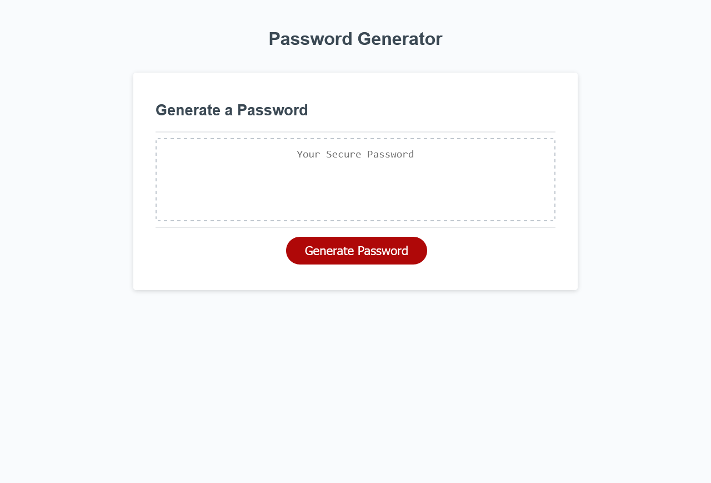

# Password Generator Starter Code
## Description
This project is a basic password generation website. It utilizes window prompts, alerts, and confirms to accept inputs from the user, and processes these inputs into a password based on user criteria. The purpose of this project was to gain familiarity with Javascript. 

## Installation
N/A

## Usage
To use the password generator, simply click "Generate Password", answer the prompts, and when complete, copy your password.

## License
Please see the license in the repository.